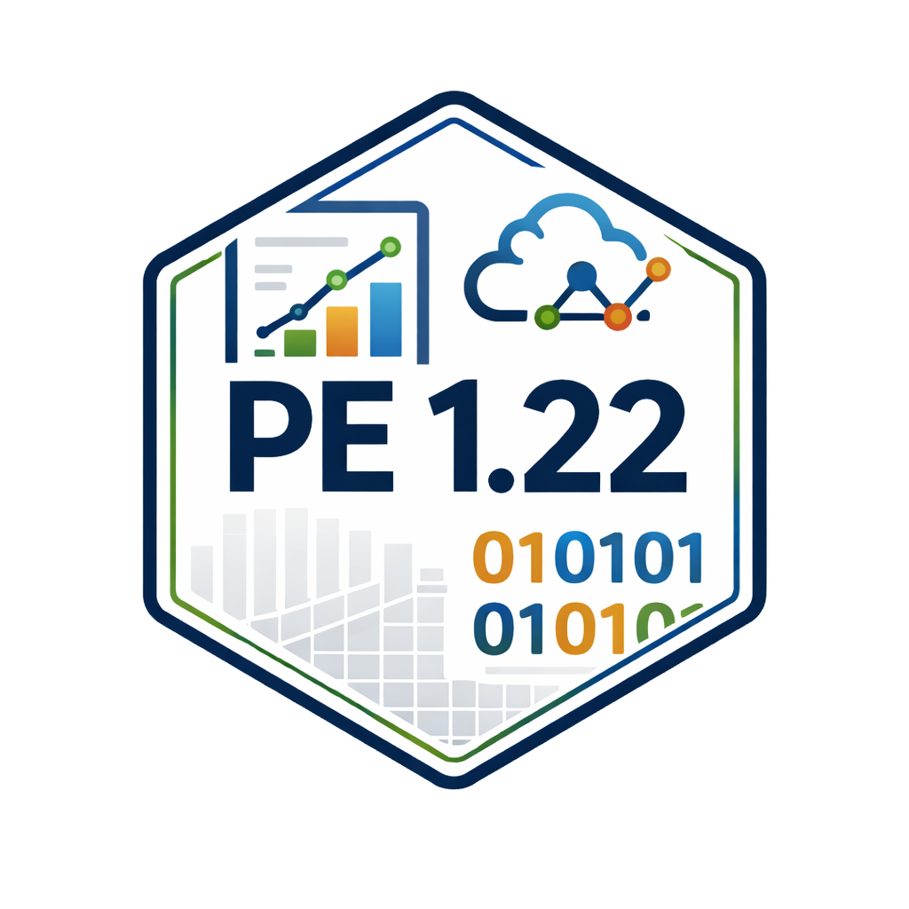

I teach undergraduate courses at the [German Sport University Cologne](https://www.dshs-koeln.de/en/).

## PE 1.22 Data Analysis, Modeling, and Visualization in Sports

::: {.grid}

::: {.g-col-3}

*since 2026*

[Course Website](https://pe1-22.github.io/) (in German)

:::

::: {.g-col-9}

This module provides an introduction to data analysis, modeling, and visualization in sports. The course covers the basics of programming in R, advanced statistical methods (e.g., logistic regressions, basics of machine learning), and data visualization using dashboards and plots. 

Student work on their own data analysis project, which they present at the end of the semester. The course is designed for students with no prior programming experience and is open to students from all sports-related disciplines.

I personally designed this module and pushed three years to get it implemented as a elective course for Bachelor students in the field of sport and exercise science. I am responsible for the content and organization of the course, and I teach the seminars together with Robert Rein and Björn Braunstein.

:::

:::

## SUL 1.12 Theory and Practice of Triathlon

::: {.grid}

::: {.g-col-3}

*since 2023*

[Student podcast series](https://open.spotify.com/show/1H1iYlE5i1RJhVmlaAKjyW) (in German)

:::

::: {.g-col-9}

This module provides an advanced introduction to the theory and practice of triathlon. The course covers two semesters, in which students learn about the physiological, diagnostic, and training aspects of triathlon. The course includes seminars as well as practical sport sessions. In the end, the students compete in a triathlon competition and receive coaching licenses.

I teach this course together with Oliver Quittmann.

:::

:::

## Former courses:
- Tutor for "Introduction to Statistics" (2021-2024)